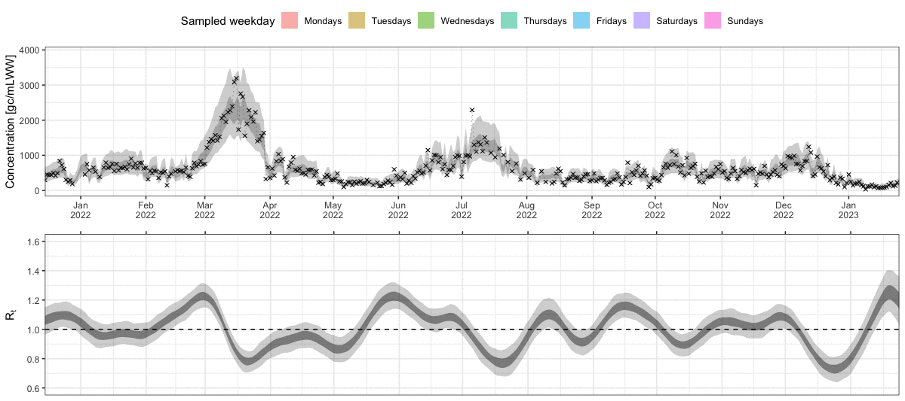

```{r, include = FALSE}
knitr::opts_chunk$set(
  collapse = TRUE,
  comment = "#>",
  fig.path = "man/figures/README-",
  out.width = "100%",
  dpi = 330,
  message = FALSE,
  warning = FALSE
)
```

```{r, eval = TRUE, include = FALSE}
require(emo)
```

<a href='https://adrian-lison.github.io/EpiSewer/'></a>

# EpiSewer: Estimate Epidemiological Parameters from Wastewater Measurements

<!-- badges: start -->
[](https://www.tidyverse.org/lifecycle/#experimental)
[](https://github.com/epinowcast/epinowcast/blob/master/LICENSE.md/)
[](https://zenodo.org/doi/10.5281/zenodo.10569101)
<!-- badges: end -->

## About
The `EpiSewer` R package provides a Bayesian generative model to estimate
effective reproduction numbers and other epidemiological parameters from
concentration measurements at a wastewater treatment plant (or other sampling
site) over time. This allows to track the transmission dynamics of a pathogen in
the associated catchment population. The `EpiSewer` model is tailored to the
specifics of wastewater concentration measurements, offers comprehensive
uncertainty quantification via MCMC sampling in `stan`, and provides easily
configurable modeling components.

```{r, echo = FALSE}

```

## Model highlights
**Measurements**  
`r emo::ji("star")` Non-daily / missing measurements  
`r emo::ji("star")` Multiple measurements (replicates) per sample  
`r emo::ji("star")` Multi-day composite samples  
`r emo::ji("star")` Accurate dPCR noise model  
`r emo::ji("star")` Limit of detection (LOD) model  

**Sampling**  
`r emo::ji("star")` Sample batch effects (e.g. weekday or age-of-sample effects)  

**Sewer**  
`r emo::ji("star")` Flow normalization  
`r emo::ji("star")` Sewer residence time distributions  

**Shedding**  
`r emo::ji("star")` Incubation period and shedding load distributions  
`r emo::ji("star")` Individual-level shedding load variation

**Infections**  
`r emo::ji("star")` Stochastic infection model with overdispersion  
`r emo::ji("star")` Flexible $R_t$ smoothing (random walk, exponential smoothing, splines)  
`r emo::ji("star")` Transmission indicators: $R_t$, growth rate, doubling time, and
more  

**Forecast**  
`r emo::ji("star")` Probabilistic forecasts of $R_t$, infections, concentrations and more

## Installing the package

The development version of `EpiSewer` can be installed from GitHub as shown below. Please note that the package is still in early development and may be subject to breaking changes. 

```{r, eval = FALSE}
remotes::install_github("adrian-lison/EpiSewer", dependencies = TRUE)
```

`EpiSewer` also requires CmdStan to be installed on your system. This can be done using the `install_cmdstan()` function from `cmdstanr`. If you experience any problems installing CmdStan, see the [cmdstanr vignette](https://mc-stan.org/cmdstanr/articles/cmdstanr.html) for help. 

```{r, eval = FALSE}
cmdstanr::check_cmdstan_toolchain()
cmdstanr::install_cmdstan(cores = 2) # use more cores to speed up
```

The stan models used by EpiSewer need to be compiled for your device. This is only necessary once - after installing or updating the package - and can be done using the `sewer_compile()` function.
```{r, eval = FALSE}
EpiSewer::sewer_compile()
```

If the models are not successfully compiled, please ensure that `cmdstan` is properly set up and try updating it to a newer version using `cmdstanr::install_cmdstan()`. If the problem persists, please run `EpiSewer::sewer_compile(verbose = TRUE)` and post the output in a new issue on GitHub, along with your `cmdstanr::cmdstan_version()`.

## Introduction

This is a quick introduction to using the `EpiSewer` package. To learn more about modeling with `EpiSewer`, see the [model specification](https://adrian-lison.github.io/EpiSewer/articles/model-specification.html) and [detailed example](https://adrian-lison.github.io/EpiSewer/articles/detailed-example.html) vignettes on the [package website](https://adrian-lison.github.io/EpiSewer/).

### Loading the package

`EpiSewer` comes with `data.table` for data manipulation and `ggplot2` for plotting.
```{r}
library(EpiSewer)
library(data.table)
library(ggplot2)
```

### Data

#### Data requirements

The below example of wastewater data is from Zurich, Switzerland. Data are
provided by EAWAG (Swiss Federal Institute of Aquatic Science and Technology) to
the public domain (CC BY 4.0 license).
```{r}
data_zurich <- SARS_CoV_2_Zurich
names(data_zurich)
```

- `measurements`: `EpiSewer` requires a time series of concentration
  measurements. Measurements should ideally be in gc/mL (gc = gene
  copies).
- `flows`: Data about the daily wastewater volume flowing through the
  sampling site (should be in mL/day). Flow data is highly recommended,
  but not strictly necessary (see documentation of `flows_assume()`).
- `cases`: Data about confirmed cases in the catchment area. This is
  optional but can help informing some of our prior assumptions.

##### Measurements
The `measurements` data contains daily viral concentration measurements (in
gc/mL) for the SARS-CoV-2 N1 gene at the wastewater treatment plant in Zurich.
Some days have missing measurements, but this is no problem: `EpiSewer`
naturally accounts for missing values during estimation.
```{r}
data_zurich$measurements
```

To show the handling of missing data more clearly, we make our data artificially
sparse by keeping only measurements that were made on
*Mondays* and *Thursdays.* This means we will only have two measurements
per week.
```{r}
measurements_sparse <- data_zurich$measurements[,weekday := weekdays(data_zurich$measurements$date)][weekday %in% c("Monday","Thursday"),]
head(measurements_sparse, 10)
```

##### Flows
The `flows` data tracks the daily flow (in mL/day) at the treatment plant in
Zurich. The flow data will be used to normalize the concentration measurements.
This helps to account for environmental factors such as rainfall. It is
important that the flow uses the same volume unit as the concentration (mL here
in both cases).
```{r}
data_zurich$flows
```
`r emo::ji("exclamation_mark")` Note: It's not a problem if you only have flow
data on dates with measurements. However, for each measured date, there must
also be a flow value. If flow information is missing for measured dates, please
make sure to impute it using a suitable method before passing it to `EpiSewer`
(or drop those dates).

##### Cases
Finally, if we have case data available, we can also pass this to `EpiSewer.`
This is then used to calibrate the model so that the estimated number of
infections approximately matches the observed number of cases.
```{r}
data_zurich$cases
```
If you don't have case data: don't worry! In general, the assumed shedding load
per case does not have a large effect on the effective reproduction number, and
`EpiSewer` will use a robust default. You just have to keep in mind that the
absolute number of infections estimated by `EpiSewer` should **not be
interpreted as true incidence or prevalence**.

#### Gather the data

We combine the `measurements` data and `flow` data using the helper function `sewer_data()`. We here use our artificially sparse measurements (only Mondays and Thursdays). For calibration purposes, we also supply the case data, as explained above.
```{r}
ww_data <- sewer_data(
  measurements = measurements_sparse,
  flows = data_zurich$flows,
  cases = data_zurich$cases # cases are optional
  )
```

### Assumptions

In order to estimate the effective reproduction number from wastewater
concentration measurements, we have to make a number of assumptions.

- **Generation time distribution**: Distribution of the time between a
primary infection and its resulting secondary infections
- **Shedding load distribution**: Distribution of the load shed by an
average individual over time. We also specify that our distribution is relative
to the day of symptom onset.
- **Incubation period distribution**: Because our shedding load
distribution is in *days since symptom onset*, we also need to make an
assumption about the time between infection and symptom onset.

The generation time, shedding load and incubation period distribution are all
disease-specific and are typically obtained from literature. `EpiSewer` requires
these distributions to be discretized, and offers specific functions to obtain
discretized versions of popular continuous probability distributions.

```{r}
ww_assumptions <- sewer_assumptions(
  generation_dist = get_discrete_gamma_shifted(gamma_mean = 3, gamma_sd = 2.4),
  shedding_dist = get_discrete_gamma(gamma_shape = 0.929639, gamma_scale = 7.241397),
  shedding_reference = "symptom_onset", # shedding load distribution is relative to symptom onset
  incubation_dist = get_discrete_gamma(gamma_shape = 8.5, gamma_scale = 0.4)
)
```

`r emo::ji("bulb")` Sometimes, shedding load distributions are instead specified
in *days since infection*. In that case, you can use `shedding_reference =
"infection"` and don’t need to supply an incubation period distribution.

### Estimation

Now that we have the data and necessary assumptions, we can use `EpiSewer` to estimate the effective reproduction number. We here use the default model and settings provided by `EpiSewer`. With the helper function `set_fit_opts()` we specify our sampling approach: we apply Hamiltonian MCMC sampling via stan, using 4 chains with 500 warmup and 500 sampling iterations each.

Stan regularly provides updates about the progress of the sampler. The overall 
runtime will depend on your hardware resources, the size of the data, 
the complexity of the model used, and how well the model actually fits the data.
On a MacBook Pro (2 GHz Quad-Core Intel Core i5) the example below takes about 5 minutes to run.
```{r, eval = FALSE}
options(mc.cores = 4) # allow stan to use 4 cores, i.e. one for each chain
ww_result <- EpiSewer(
  data = ww_data,
  assumptions = ww_assumptions,
  fit_opts = set_fit_opts(sampler = sampler_stan_mcmc(
    iter_warmup = 500, iter_sampling = 500, chains = 4, seed = 42
    ))
)
```

`r emo::ji("bulb")` We are here using a shorthand version of the `EpiSewer()` function which uses all available default settings. To find out how the `EpiSewer` model can be customized, see the [model specification](https://adrian-lison.github.io/EpiSewer/articles/model-specification.html) and [detailed example](https://adrian-lison.github.io/EpiSewer/articles/detailed-example.html) vignettes.

```{r, eval = FALSE, include = FALSE}
saveRDS(ww_result, file.path("data", "result_example.rds"))
```

```{r, eval = TRUE, include = FALSE}
ww_result <- readRDS(file.path("data", "result_example.rds"))
```

### Plotting the results

Great, the sampling has completed! Now we can inspect the results of our model. 
Plots are a convenient way to get a quick overview.

#### Model fit
It is good practice to first assess how well the model actually fitted to the
data. For this, we plot the observed concentration measurements against the ones
predicted by the model. The inner and outer ribbons show the 50% and 95%
credible intervals. The black dots show measurements that we have actually
observed in our artificially sparse data set (only Mondays and Thursdays). The
grey crosses show all the other measurements that were not available to the
model. As we can see, the model still achieved a decent fit on these missing
days.

```{r concentration}
plot_concentration(ww_result, measurements = data_zurich$measurements)
```

By default, the function `plot_concentration()` shows absolute concentrations,
which strongly depend on the daily wastewater flow. Alternatively, we can plot
the flow-normalized concentration by setting `normalized = TRUE`. This will show
the hypothetical concentration if the flow was at its median value. For this
option, we need to provide the flow data as well (see below).

```{r concentration_normalized}
plot_concentration(ww_result, measurements = data_zurich$measurements, flows = data_zurich$flows, normalized = TRUE)
```
As can be seen, the normalization removes the noise due to the daily variation
of flow. The remaining uncertainty is due to the measurement noise and other
sources of variation.

#### Time-varying effective reproduction number
Since the model fit looked decent at first glance, we now inspect our main
parameter of interest, the effective reproduction number over time. Again, the
ribbons show the 50% and 95% credible intervals. We see that even with only two
measurements per week, we get a fairly clear signal for R being above or below
the critical threshold of 1.
```{r R}
plot_R(ww_result)
```

Note that the estimates for R go back further into the past than our
observations. This is due to the delay from infection to shedding, i.e.
concentration measurements observed today are mostly a signal of infections in
the past. This is also why the R estimates close to the present are strongly
uncertain. The measurements observed until the present provide only a delayed
signal about transmission dynamics, so the most recent R estimates are informed
by only little data.

#### Growth report

We can also display a growth report which shows the probability that
infections have been growing for a prolonged period of time. By default,
`EpiSewer` selects the most recent date for which reliable estimates are
possible as a reference.

```{r growth_report}
plot_growth_report(ww_result)
```
As the model was fitted at the end of the seasonal wave in Zurich, there is high
posterior support that infections are currently not growing for a prolonged
period of time.

You can also display a growth report for other dates. Let’s for example
have a look at the report for mid-February 2022. Here we can see that
there is strong posterior support that infections have been growing for
at least a week. At the same time, it seems rather unlikely that they
have already been growing for 3 weeks or longer.

```{r growth_report2}
plot_growth_report(ww_result, date = "2022-02-19")
```

`r emo::ji("bulb")` `EpiSewer` also provides further indicators of transmission dynamics,
see e.g. `plot_growth_rate()` and `plot_doubling_time()`. These can
however be more volatile and sometimes difficult to interpret.

#### Latent parameters

We can also inspect other internal parameters of the model. This may give us a better
understanding of the model fit and may help to diagnose certain problems.

First, we plot the estimated load over time. This is the expected total load that arrived
at the sampling side on a given day. We can see this is roughly on the order 1e14 to 3e14.
```{r load}
plot_load(ww_result)
```
Next, we plot the estimated number of infections over time. The time series
follows a very similar trend as the load. Compared to the load, the peak in
infections seems to be a bit more spiked, and also a bit earlier. This is
because infected individuals only begin shedding after their infection and then
shed over a longer period of time (as defined by the incubation period and
shedding load distribution). This makes the load a slightly delayed and blurred
signal of the infections.

```{r infections}
plot_infections(ww_result)
```

Note that because we supplied case data, the estimated infections *rougly* match
the case numbers (plotted in blue below). Nevertheless, the infections plot shown
here should only be used for diagnostic purposes, for example to ensure that the
trend looks sensible and that the scale of infections is not unrealistic (not
millions of infections or 0.01 infections per day). Please do **not** interpret the
estimated number of infections in terms of true absolute incidence or
prevalence.

```{r infections_with_cases}
plot_infections(ww_result) + geom_step(data = data_zurich$cases, aes(x = date, y = cases), color = "#000080")
```

We can also compare the prior and posterior distribution for certain parameters of the model to see how much they were informed by the data. For example, we can inspect the coefficient of variation (CV) of the observation noise:
```{r prior_posterior_noise_cv}
plot_prior_posterior(ww_result, "measurement_noise_cv")
```
As we can see, the prior (in grey) and posterior (in blue) differ substantially, indicating that this parameter is well informed by the data.

### More details
We can further inspect our results object. It has three attributes:
```{r}
names(ww_result)
```

The `job` attribute stores all information about the job that was defined via `EpiSewer`. It contains
the data used, alongside meta-information, and the settings for the sampler. By calling
`run(ww_result$job)`, the job can be run again.
```{r}
names(ww_result$job)
```

In particular, we can print a concise summary of the modeling details (the `EpiSewer` defaults in this case):
```{r}
ww_result$job$model
```
`r emo::ji("right_arrow")` Check out the [model specification](https://adrian-lison.github.io/EpiSewer/articles/model-specification.html) and [detailed example](https://adrian-lison.github.io/EpiSewer/articles/detailed-example.html) vignettes to better understand the modeling details and customize the `EpiSewer` model.

The `summary` attribute stores summarized results for important parameters from the model.
```{r}
names(ww_result$summary)
```

For example, we can access the exact estimates for the reproduction number.
```{r}
head(ww_result$summary$R, 5)
```

The `fitted` attribute provides access to all details of the fitted stan model
(see [cmdstanr](https://mc-stan.org/cmdstanr/reference/CmdStanMCMC.html) for
details). For example, we can use this to show sampler diagnostics for each
chain:

```{r}
ww_result$fitted$diagnostic_summary()
```

Finally, the `checksums` attribute gives us several checksums that uniquely identify the job which was run. These can be used to check whether two
job results used the same or different models, input data, fitting options, or inits. If all checksums are identical (and the seed is not `NULL`), then the results should also be identical.
```{r}
ww_result$checksums
```
