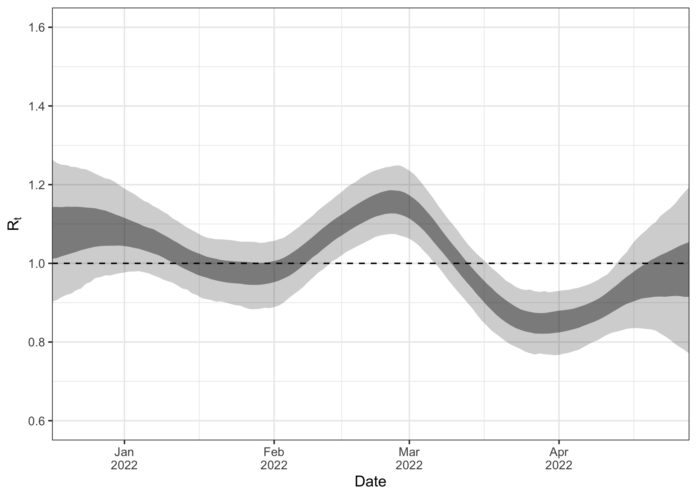

# EpiSewer: Estimate Reproduction Numbers from Wastewater Measurements

[](https://github.com/epinowcast/epinowcast/blob/master/LICENSE.md/)

## Installing the package

The development version of `EpiSewer` can be installed from GitHub as
shown below. Please note that the package is still highly experimental
and may be subject to breaking changes.

``` r
remotes::install_github("adrian-lison/EpiSewer", dependencies = TRUE)
```

## Introduction

### Loading the package

EpiSewer comes with `data.table` for data manipulation and `ggplot2` for
plotting.

``` r
library(EpiSewer)
library(data.table)
library(ggplot2)
```

### Data

#### Load exemplary data

The below wastewater data are from Zurich, Switzerland. They are
provided by EAWAG (Swiss Federal Institute of Aquatic Science and
Technology) to the public domain (CC BY 4.0 license).

``` r
data_zurich <- SARS_CoV_2_Zurich
```

#### Inspect the data

The dataset contains `measurements`, `flows` and metadata about `units`.
There is also data about confirmed cases in the catchment area, which we
do not need explicitly, but can use to inform some of our prior
assumptions.

``` r
str(data_zurich)
#> List of 4
#>  $ measurements:Classes 'data.table' and 'data.frame':   151 obs. of  2 variables:
#>   ..$ date         : Date[1:151], format: "2022-01-01" "2022-01-02" ...
#>   ..$ concentration: num [1:151] NA NA 456 748 574 ...
#>   ..- attr(*, ".internal.selfref")=<externalptr> 
#>  $ flows       :Classes 'data.table' and 'data.frame':   151 obs. of  2 variables:
#>   ..$ date: Date[1:151], format: "2022-01-01" "2022-01-02" ...
#>   ..$ flow: num [1:151] 3.41e+11 3.41e+11 1.59e+11 1.61e+11 3.72e+11 ...
#>   ..- attr(*, ".internal.selfref")=<externalptr> 
#>  $ cases       :Classes 'data.table' and 'data.frame':   151 obs. of  2 variables:
#>   ..$ date : Date[1:151], format: "2022-01-01" "2022-01-02" ...
#>   ..$ cases: num [1:151] NA NA 323 367 348 ...
#>   ..- attr(*, ".internal.selfref")=<externalptr> 
#>  $ units       :List of 2
#>   ..$ concentration: chr "gc/mL"
#>   ..$ flow         : chr "mL/day"
```

The measurements data contains daily viral concentration measurements
(in gc/mL, gc = gene copies) for the SARS-CoV-2 N1 gene at the
wastewater treatment plant in Zurich. Some days have missing
measurements, but this is no problem: `EpiSewer` naturally accounts for
missing values during estimation.

``` r
data_zurich$measurements
#>            date concentration
#>   1: 2022-01-01            NA
#>   2: 2022-01-02            NA
#>   3: 2022-01-03      455.7580
#>   4: 2022-01-04      747.8792
#>   5: 2022-01-05      573.7020
#>  ---                         
#> 147: 2022-05-27      278.0198
#> 148: 2022-05-28      238.0627
#> 149: 2022-05-29      161.5694
#> 150: 2022-05-30      600.0688
#> 151: 2022-05-31      418.8482
```

The flows data tracks the daily flow (in mL/day) at the treatment plant
in Zurich. The flow data will be used to normalize the concentration
measurements. This helps to account for environmental factors such as
rainfall. It is important that the flow uses the same volume unit as the
concentration (mL here in both cases).

``` r
data_zurich$flows
#>            date         flow
#>   1: 2022-01-01 341163082483
#>   2: 2022-01-02 341163082483
#>   3: 2022-01-03 158972454250
#>   4: 2022-01-04 160849294683
#>   5: 2022-01-05 372301227483
#>  ---                        
#> 147: 2022-05-27 149443751917
#> 148: 2022-05-28 142955378400
#> 149: 2022-05-29 143776386433
#> 150: 2022-05-30 151964157700
#> 151: 2022-05-31 155315855550
```

#### Gather the data

If the measurements data and flow data are stored in separate variables,
you can combine them using the helper function `sewer_data()`. In the
present example, this would not be necessary, as they are already in the
same list.

``` r
ww_data = sewer_data(measurements = data_zurich$measurements, flows = data_zurich$flows)
```

### Assumptions

In order to estimate the effective reproduction number from wastewater
concentration measurements, we must make a number of assumptions.

#### Distributions

- **Generation time distribution**: Distribution of the time between a
  primary infection and its resulting secondary infections
- **Incubation period distribution**: Time between infection and symptom
  onset. It is here assumed that shedding only starts with symptom
  onset.
- **Shedding load distribution**: Distribution of the load shed by an
  average individual over time since their symptom onset.

The generation time, incubation period and shedding load distribution
are all disease-specific and are typically obtained from literature.
`EpiSewer` requires these distributions to be discretized, and offers
specific functions to obtain discretized versions of popular continuous
probability distributions.

``` r
generation_dist = get_discrete_gamma_shifted(gamma_mean = 3, gamma_sd = 2.4, maxX = 12)
incubation_dist = get_discrete_gamma(gamma_shape = 8.5, gamma_scale = 0.4, maxX = 10)
shedding_dist = get_discrete_gamma(gamma_shape = 0.929639, gamma_scale = 7.241397, maxX = 30)
```

#### Shedding load per case

In addition to the shedding load distribution, we also require a scaling
factor that describes how much total viral material is shed by the
average infected individual and is detectable at the sampling site. We
call this scaling factor *shedding load per case* because it scales the
estimated number of cases/infections in our model. The shedding load per
case (gc/person) depends both on biological factors as well as on the
sewage system.

Fortunately, if we are only interested in the effective reproduction
number, a rough estimate for the shedding load per case is sufficient:
getting it wrong cannot bias the reproduction number estimates, and will
distort the uncertainty of estimates only in rather extreme cases.

If we also have case data available (ideally catchment-specific, or we
might down-scale case counts from a higher aggregation level to roughly
the size of our catchment), then we can use the function
`suggest_load_per_case` to obtain a rough estimate of a suitable
shedding load per case. The argument `ascertainment_prop` can be used to
account for underdetection of infections. For simplicity, we here assume
`ascertainment_prop=1`, meaning that 100% of infections become confirmed
cases (which is often not realistic).

``` r
suggest_load_per_case(data_zurich$measurements,
                      data_zurich$flows,
                      data_zurich$cases,
                      ascertainment_prop = 1)
#> [1] 6e+11
```

Hence we will assume `6e+11 gc/person` as the average shedding load.

``` r
load_per_case <- 6e+11
```

#### Combining all assumptions

The above assumptions can be conveniently recorded in a list by using
the function `sewer_assumptions()`.

``` r
ww_assumptions = sewer_assumptions(
            generation_dist = generation_dist,
            incubation_dist = incubation_dist,
            shedding_dist = shedding_dist,
            load_per_case = load_per_case)
```

### Estimation

Now that we have the data and the necessary assumptions, we can use
`EpiSewer` to estimate the effective reproduction number. We here use
the default model and settings provided by `EpiSewer`. With the helper
function `set_fit_opts()` we specify our sampling approach: we apply
Hamiltonian MCMC sampling via stan, using 4 chains with 1000 warmup and
1000 sampling iterations each.

Stan regularly provides updates about the progress of the sampler. The
overall runtime will depend on your hardware resources, the size of the
data, the complexity of the model used, and how well the model actually
fits the data.

``` r
options(mc.cores = 4) # allow stan to use 4 cores
ww_result <- EpiSewer(
  data = ww_data,
  assumptions = ww_assumptions,
  fit_opts = set_fit_opts(sampler = sampler_stan_mcmc(iter_warmup = 1000, iter_sampling = 1000, chains = 4))
)
```

### Plotting the results

Great, the sampling has completed! Now we can inspect the results of our
model. Plots are a convenient way to get a quick overview.

#### Model fit

It is good practice to first assess how well the model actually fitted
to the data. For this, we plot the observed concentration measurements
against the ones predicted by the model. The ribbon shows the 95%
credible interval.

``` r
plot_concentration(ww_result, measurements = ww_data$measurements)
```


By default, the function `plot_concentration()` includes the modeled
measurement noise in the predicted concentrations. If you only want to
see the predicted expected concentration without noise, set
`include_noise = FALSE`.

``` r
plot_concentration(ww_result, measurements = ww_data$measurements, include_noise = FALSE)
```


#### Time-varying effective reproduction number

Since the model fit looked decent at first glance, we now inspect our
main parameter of interest, the effective reproduction number over time.
Again, the ribbon shows the 95% credible interval.

``` r
plot_R(ww_result)
```

 We can see that
the estimates for R go back further into the past than our observations.
This is due to the delay from infection to shedding, i.e. concentration
measurements observed today are mostly a signal of infections in the
past. This is also why the R estimates close to the present are strongly
uncertain. The measurements observed until the present provide only a
delayed signal about transmission dynamics, so the most recent R
estimates are informed by only little data.

#### Latent parameters

We can also inspect other internal parameters of the model. This may
give us a better understanding of the model fit and may help to diagnose
certain problems.

First, we plot the estimated load over time. This is the expected total
load that arrived at the sampling side on a given day. We can see this
is roughly on the order 1e14 to 3e14.

``` r
plot_load(ww_result)
```

 Next, we plot
the estimated number of infections over time. The time series follows a
very similar trend as the load. Using our assumed shedding load per case
of 6e11, we can see that the peak load (roughly 3.3e14) corresponds to
3.3e14/6e11=550 infections. The peak in infections shown below seems to
be a bit higher, and it is also a bit earlier. The reason for this
difference is that infected individuals only begin shedding after their
infection and then shed over a longer period of time (as defined by the
incubation period and shedding load distribution). This makes the load a
slightly delayed and blurred signal of the infections.

``` r
plot_infections(ww_result)
```


### More details

We can further inspect our results object. It has three attributes:

``` r
names(ww_result)
#> [1] "job"     "summary" "fitted"
```

The `job` attribute stores all information about the job that was
defined via `EpiSewer`. It contains the data used, alongside
meta-information, and the settings for the sampler. By calling
`run(ww_result$job)`, the job can be run again.

``` r
names(ww_result$job)
#> [1] "job_name"            "jobarray_size"       "model_def"          
#> [4] "arguments"           "priors_text"         "arguments_meta_info"
#> [7] "overwrite"
```

The `summary` attribute stores summarized results for important
parameters from the model.

``` r
names(ww_result$summary)
#> [1] "R"                      "R_samples"              "expected_infections"   
#> [4] "infections"             "infections_samples"     "expected_onsets"       
#> [7] "expected_load"          "expected_concentration" "concentration"
```

For example, we can access the exact estimates for the reproduction
number.

``` r
ww_result$summary$R
#>            date      mean    median     lower    upper seeding
#>   1: 2021-12-04 0.9913800 0.9724195 0.6523075 1.456200    TRUE
#>   2: 2021-12-05 0.9870268 0.9725485 0.6739850 1.399216    TRUE
#>   3: 2021-12-06 0.9852909 0.9757340 0.6800632 1.378853    TRUE
#>   4: 2021-12-07 0.9840326 0.9740435 0.6817820 1.357809    TRUE
#>   5: 2021-12-08 0.9845468 0.9726190 0.6983733 1.345521    TRUE
#>  ---                                                          
#> 175: 2022-05-27 1.3893983 1.3704000 1.0500335 1.838418   FALSE
#> 176: 2022-05-28 1.4069233 1.3814250 1.0367830 1.920013   FALSE
#> 177: 2022-05-29 1.4163974 1.3853700 1.0264567 1.984677   FALSE
#> 178: 2022-05-30 1.4235431 1.3884600 1.0048388 2.060693   FALSE
#> 179: 2022-05-31 1.4329033 1.3860100 0.9633706 2.207298   FALSE
```

Finally, the `fitted` attribute provides access to all details of the
fitted stan model. See
[cmdstanr](https://mc-stan.org/cmdstanr/reference/CmdStanMCMC.html) for
details.

``` r
names(ww_result$fitted)
#>  [1] ".__enclos_env__"            "runset"                    
#>  [3] "num_chains"                 "inv_metric"                
#>  [5] "diagnostic_summary"         "sampler_diagnostics"       
#>  [7] "loo"                        "clone"                     
#>  [9] "draws"                      "output"                    
#> [11] "initialize"                 "code"                      
#> [13] "profiles"                   "return_codes"              
#> [15] "metadata"                   "time"                      
#> [17] "data_file"                  "latent_dynamics_files"     
#> [19] "profile_files"              "output_files"              
#> [21] "save_data_file"             "save_profile_files"        
#> [23] "save_latent_dynamics_files" "save_output_files"         
#> [25] "cmdstan_diagnose"           "cmdstan_summary"           
#> [27] "summary"                    "lp"                        
#> [29] "init"                       "save_object"               
#> [31] "print"                      "num_procs"
```

For example, we can use this to show sampler diagnostics for each chain:

``` r
ww_result$fitted$diagnostic_summary()
#> $num_divergent
#> [1] 0 0 0 0
#> 
#> $num_max_treedepth
#> [1] 0 0 0 0
#> 
#> $ebfmi
#> [1] 0.7917743 0.7617458 0.7900870 0.8342677
```
