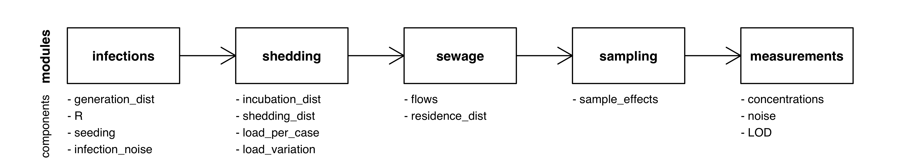

# Modeling in EpiSewer

This is a conceptual overview over the modeling functionality in
`EpiSewer`. See [here](detailed-example.md) for an example vignette.

## Modules

`EpiSewer` uses 5 different modules to describe the data generating
process behind the wastewater measurements: `infections`, `shedding`,
`sewage`, `sampling`, and `measurements`. Each of these modules consists
of a number of module components, as shown below.


The modules are defined using their corresponding module function,
i.e. by calling `model_infections()`, `model_shedding()`,
`model_sewage()`, `model_sampling()`, or `model_measurements()`.

## Modeling functions

Components in a module can be specified using suitable modeling
functions. There are 4 types of modeling functions:

- `_observe`: We provide observation data for this component. For
  example, we can use `concentrations_observe()` if we have observed
  concentration measurements and want to fit the model to them.
- `_assume`: We assume the values for this component. For example, we
  can use `generation_dist_assume()` to provide a generation time
  distribution from the literature.
- `_estimate`: We estimate this component as a parameter of the model.
  For example, we can use `noise_estimate()` if we don’t know how much
  noise the measurements have and want to estimate this from the data.
- `_none`: We do not model this component. For example, we can use
  `sample_effects_none()` if we don’t want to model any sample effects
  on the measurements.

To find out which modeling functions are available for a given
component, you can consult the documentation or use the helper
`component_functions()`:

``` r
EpiSewer::component_functions("infection_noise")
#> [1] "infection_noise_none()"     "infection_noise_estimate()"
```

#### 💡 Multiple modeling options

Some components have multiple versions of the same modeling function
type. For example, there are currently three approaches to estimate the
reproduction number, namely `R_estimate_splines` (smoothing splines),
`R_estimate_rw` (random walk), and `R_estimate_ets` (exponential
smoothing).

``` r
EpiSewer::component_functions("R")
#> [1] "R_estimate_rw()"      "R_estimate_ets()"     "R_estimate_splines()"
```

#### ❗ Modeling restrictions

Not all components support all modeling types. For example, `EpiSewer`
currently only offers `generation_dist_assume`, but not
`generation_dist_estimate` or `generation_dist_observe`.

``` r
EpiSewer::component_functions("generation_dist")
#> [1] "generation_dist_assume()"
```

This is because estimating the generation time distribution from data is
not yet supported (but may be added in the future), and directly
*observing* the generation time distribution is generally not possible.

## Data and assumptions

The `sewer_data()` and `sewer_assumptions()` functions are convenience
functions that allow you to collect all observation data and modeling
assumptions in one place. This can improve overview and allows to run
`EpiSewer` under its default settings without repeating the component
definitions:

``` r
ww_data <- sewer_data(
  measurements = SARS_CoV_2_Zurich$measurements,
  flows = SARS_CoV_2_Zurich$flows
  )

ww_assumptions <- sewer_assumptions(
  generation_dist = get_discrete_gamma_shifted(gamma_mean = 3, gamma_sd = 2.4, maxX = 12),
  incubation_dist = get_discrete_gamma(gamma_shape = 8.5, gamma_scale = 0.4, maxX = 10),
  shedding_dist = get_discrete_gamma(gamma_shape = 0.929639, gamma_scale = 7.241397, maxX = 30),
  load_per_case = 6e+11
)

EpiSewer(
  data = ww_data,
  assumptions = ww_assumptions
)
```

What happens under the hood is that when individual model components are
not provided with the data or assumptions they need, they search the
data and assumption arguments passed to the `EpiSewer` function.

💡 It is always possible to mix both approaches and specify data or
assumptions explicitly in the model component:

``` r
ww_data <- sewer_data(
  measurements = SARS_CoV_2_Zurich$measurements,
  #flows = SARS_CoV_2_Zurich$flows
)

ww_sewage <- model_sewage(
  flows = flows_observe(SARS_CoV_2_Zurich$flows)
)

ww_assumptions <- sewer_assumptions(
  generation_dist = get_discrete_gamma_shifted(gamma_mean = 3, gamma_sd = 2.4, maxX = 12),
  incubation_dist = get_discrete_gamma(gamma_shape = 8.5, gamma_scale = 0.4, maxX = 10),
  shedding_dist = get_discrete_gamma(gamma_shape = 0.929639, gamma_scale = 7.241397, maxX = 30),
  #load_per_case = 6e+11
)

ww_shedding <- model_shedding(
  load_per_case = load_per_case_assume(6e+11)
)

result <- EpiSewer(
  data = ww_data,
  assumptions = ww_assumptions,
  sewage = ww_sewage,
  shedding = ww_shedding
)
```

Note that if the same data or assumptions are supplied via the
`sewer_data()`/`sewer_assumptions()` *and* the individual component,
`EpiSewer` will compare both arguments and throw an error if they
differ.
